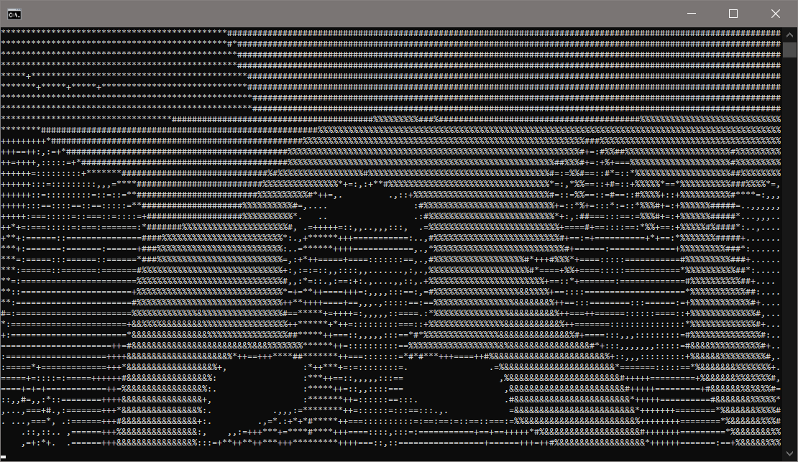

# Conversion of camera image to ASCII text in terminal

## Visualization

## Features & Controls

-   **Program displays grayscale camera view in the second window**
-   **Press _Escape_ to exit the program**
